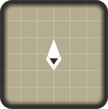

  

# ShapedCore Entity Creator
Ce projet est un plugin Figma conçu spécialement pour le jeu **[ShapedCore](https://github.com/Vaulkryn/ShapedCore)**.

---

Le but de ce plugin est de récupérer les données des formes dessinées dans Figma et de les convertir en données utilisables pour le jeu. 

## Roadmap
🛠️ En développement 
⚠️ Correctif nécessaire 
📝 Planifié 
✅ Terminé 
🔄 Reporté 
⏸️ Arrêté 
❌ Annulé 

---

### Release v0.10.0:
| Version  | Objectif                            |État|
|:--------:|:------------------------------------|:--:|
| _        | Système de correction des positions | /  |

## License
Le projet ShapedCore Entity Creator est sous licence MIT.